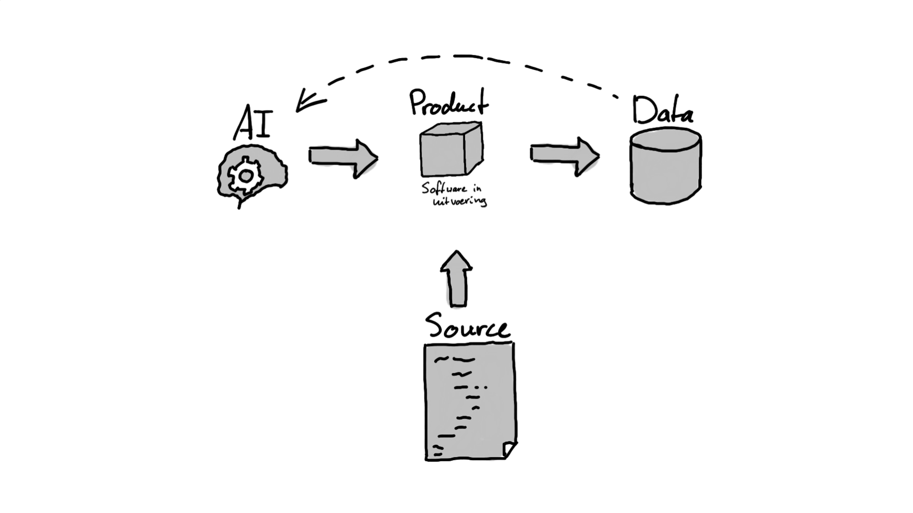
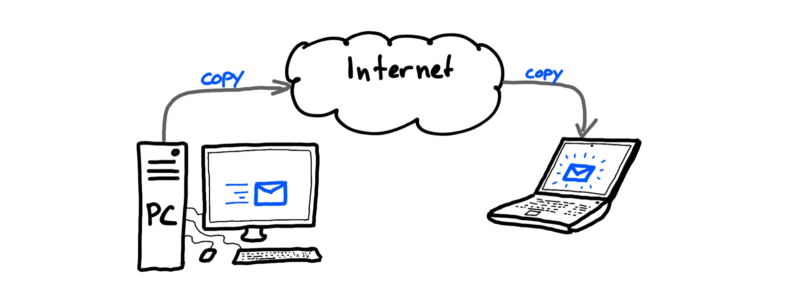
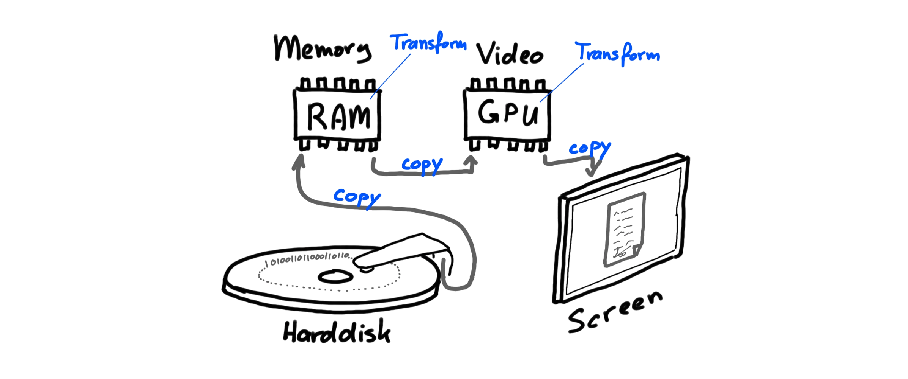

In de transitie van [papier naar digitaal](./papier-naar-digitaal.md) wordt uitgebreid gesproken
over automatisering en dat dat een opmaat is naar digitalisering. Maar er is meer te begrijpen aan
automatisering.

## Mindset

Automatisering is ook een _mindset_, een gebruik. Op het moment dat ik twee keer dezelfde handeling
doe, ga ik automatiseren. Het is een standaard onderdeel van het basisonderwijs in Nederland, waarin
kinderen leren om hun brein te trainen in het 'standaard uitvoeren van taken'. Dat is automatiseren.
Dat passen we dus breed toe.

> _Software is eating the world_ - Marc Andreessen
{id="software-is-eating-the-world"}

Vandaag de dag is technologie een gewoon onderdeel van ons dagelijks leven en de samenleving.
Technologie is en/of bevat software. Veel van onze processen kunnen we automatiseren. Vooral de
herhalende en repeterende werkzaamheden. Anno 2024 met de massale toegankelijkheid van AI systemen
die overal oppoppen, wordt dat alleen maar duidelijker.

Naar de toekomst toe moeten we daarom meenemen dat veel van wat we nu nog handmatig doen, waar we nu
nog toegevoegde waarde van mensen zien, geautomatiseerd zou kunnen gaan worden. Het is een mindset
om _gericht_ te zijn op automatisering ... tot het punt dat we onszelf gaan weg automatiseren. Gaan
we daar ooit komen? Geen idee. Hebben we taken die in het verleden als 'dat zullen mensen altijd
blijven doen' ondertussen al standaard geautomatiseerd? JA! Kleren wassen we met een wasmachine.
Afwas doen we met de vaatwasser. Teksten op borden in het buitenland vertalen we met Google Lens.
Communiceren met mensen in een voor ons onbekende taal, doen we mbv onze devices.

Onderdeel van het **denken in protocollen** is dat we gericht zijn op de mogelijkheden van automatisering.
Software, code, scripting zouden niet als 'eng' moeten worden beschouwd, maar als normaal onderdeel
van _ieders_ werk (en privéleven). Er zijn al tools beschikbaar, die dit ook toegankelijk maken voor
iedereen. AI gaat daar nog eens een versnelling in teweeg brengen.

Uitgangspunt is dus automatisering als essentieel onderdeel van de toekomst. Dan is machine-leesbare
informatie, data, gegevens ... en regels van groot belang! Dat ondersteunt nog meer de transitie van
[papier naar digitaal](./papier-naar-digitaal.md).

## Data, software en algoritme

Vandaag de dag lijkt **data** het belangrijkste te zijn in het digitale domein. Gezien vanuit de
geschiedenis van [papier naar digitaal](./papier-naar-digitaal.md) is dat ook wel herkenbaar. En
toch ... Data alleen is nog steeds 'gewoon data'. Er is software nodig om die data te kunnen
doorzoeken, bekijken, bewerken. De software is daarmee _even belangrijk_ als de data zelf. Dat past
ook bij [bovengenoemde quote](#software-is-eating-the-world) van Marc Andreessen.

Algoritmes en Artificial Intelligence (AI) staat ook groot in de belangstelling. Het is van belang
om te beseffen hoe deze samenhangt met software en data. Het volgende plaatje geeft deze samenhang
weer:

In broncode (sources) staan de computer instructies van de software. Als deze door de computer
uitgevoerd worden, hebben we het over software. Een product. Een systeem. Deze software maakt
gebruik van data en produceert data. Artificial Intelligence algoritmes zijn (onder andere)
getrainde modellen, eigenlijk statistieken, op basis van data. Zo'n AI model kan dan vervolgens weer
in software gebruikt worden bij de interpretatie data en de productie van nieuwe data.

## Internet

Een ander aspect dat van belang is bij automatisering en computertechniek, is de eigenlijke werking
van de computer en het internet. We hebben het - als voorbeeld - over het algemeen namelijk (nog
steeds) over het versturen van een email. Dat is echter gebruik van woorden en beeldspraak vanuit
het _papieren tijdperk_. In computertechniek _bestaat dat helemaal niet!_

Als wij een email _versturen_, dan wordt er een _kopie_ van de data die de email voorstelt, ergens
anders opgeslagen ... om vervolgens verder _gekopieerd_ te worden. We zeggen _versturen_ maar
feitelijk doen we _kopiëren_. Een email in mijn mailbox is _altijd_ een kopie van het 'origineel'
dat op de computer van de verzender staat.

Sterker nog, zelfs _binnen één computer_ wordt met kopieën gewerkt! Als een computer uit is, staat
de data _alleen_ op de hard disk, de harde schijf. Zodra we de computer aan zetten, worden gegevens
(data) van de harde schijf gelezen en 'geladen' in het geheugen (memory of RAM). Met laden bedoelen
we feitelijk _kopiëren_. De data staat nog steeds op de harde schijf op exact dezelfde manier als
toen de computer uit was. Als we 'iets' met die data doen, dan wordt deze naar het interne geheugen
gekopieerd. Als deze vervolgens op het scherm zichtbaar gemaakt dient te worden, wordt de data
getransformeerd naar de input voor de _Graphical Processing Unit_, de GPU. Deze bevat ook geheugen
(memory) waarin dan opnieuw een _kopie_ van de getransformeerde, oorspronkelijke data staat.
Vervolgens worden verdere transformaties uitgevoerd naar schermresoluties en pixels ... en wordt een
volgende _kopie_ in het geheugen van de GPU bewaard. Deze wordt naar het scherm _gekopieerd_ welke
een voor ons zichtbaar beeld presenteert. Feitelijk zijn het pixels van een bepaalde kleur die een
_representatie_ geven van een document met letters die voor ons betekenis heeft. Dit heeft nog
weinig te maken met de oorspronkelijke data van eenen en nullen op de harde schijf van de computer.
_Origineel_ en _kopie_ zijn in computertechniek nietszeggende woorden geworden.

