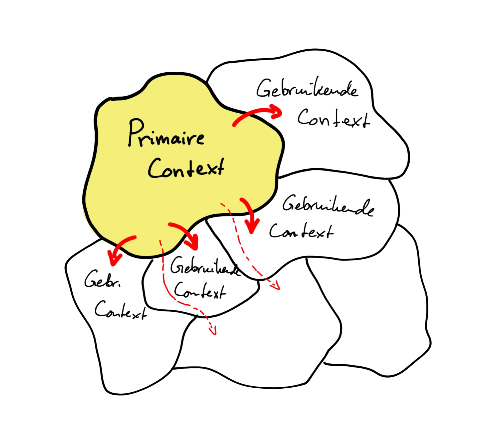

In de uitvoering van wetgeving door de overheid (als voorbeeld) liggen er specifieke wetten ten
grondslag. Deze wetten hebben een bepaalde scope, doelgerichtheid en reikwijdte. Veel uitvoering
vindt plaats binnen slechts één wet of wetscontext. Fysieke objecten in de ruimte of ik als persoon
ben echter onderwerp welke door meerdere wetten geraakt wordt. Al die wetten hebben wel een
samenhang maar zijn niet in samenhang geschreven. Sterker nog, er zijn voldoende voorbeelden dat er
ruimte is _tussen_ wetten of dat in de uitvoering bijv. ik als burger door de _combinatie van
meerdere wetten_ in een slecht positie terecht kom ... zonder uitgang. De wetten zijn immers niet in
samenhang ontworpen, in ieder geval niet tot in alle finesses.

Er zal nooit een volledig in samenhang ontworpen wetgeving en uitvoering zijn of komen. Net zoals er
nooit één enkel samenhangend model van de werkelijkheid zal zijn. Dat is simpelweg niet mogelijk.
Dan hebben we (dus) andere methodieken en benadering nodig. En dat kan!

We moeten daarom constateren dat bij het [ontstaan van data](./ontstaan-van-data.md) er vaak
(altijd?) slechts één wet aan ten grondslag ligt. Je zou kunnen zeggen: één **context**. Sterker
nog, wij deponeren hier de stelling dat het ontstaan van data _altijd_ één context heeft, welke heel
duidelijk en expliciet is. Data ontstaat _altijd_ op één plaats, één tijd door één
(verantwoordelijke) actor. Dit is de context waarin de data ontstaat.

Tot zover het _ontstaan_ van data uit één context. Over naar het _gebruik_ van data. Daar waar de
data gebruikt wordt, is steeds vaker veelzijdig en vanuit heel verschillende perspectieven. Dit
duiden we aan met _gebruikscontexten_. Vanuit de _ontstaanscontext_ zijn er vaak vele
_gebruikscontexten_ en elke 'overgang' dient expliciet ontworpen te worden. Hierin wordt verantwoord
hoe begrippen en semantiek op elkaar aansluiten (of niet) tussen de contexten en welke
transformatie(s) er nodig zijn en toegepast worden.

Data uitwisseling vindt altijd plaats _tussen_ partijen. Er zijn dus altijde _meerdere_ partijen
betrokken. Hoe die uitwisseling plaatsvindt, is daarom een afspraak tussen de partijen. Voor een
ontstaanscontext is het prettiger als er een beperkt aantal context overgangen gedefinieerd zijn en
geleverd worden. Dit is in het belang van de ontstaanscontext eigenaar welke ook wel bronhouder
genoemd wordt. Daar ontstaat tenslotte de data. Het is daarom aan de ontstaanscontext eigenaar /
bronhouder om te organiseren dat alle gebruikscontexten goed worden voorzien en geoptimaliseerd
worden door uniformiteit.

In het ontwerpen van contexten en contextovergangen is [taal en semantiek](./taal-en-semantiek.md)
van groot belang ...

> In <a href="https://martinfowler.com/bliki/DomainDrivenDesign.html" target="_blank">Domain Driven
> Design</a> is <a href="https://martinfowler.com/bliki/BoundedContext.html" target="_blank">Bounded
> Contexts</a> een expliciet begrip. Dit is goede basis om dit hoofdstuk goed te doorgronden.
