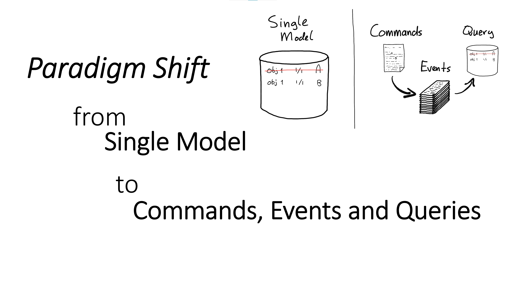
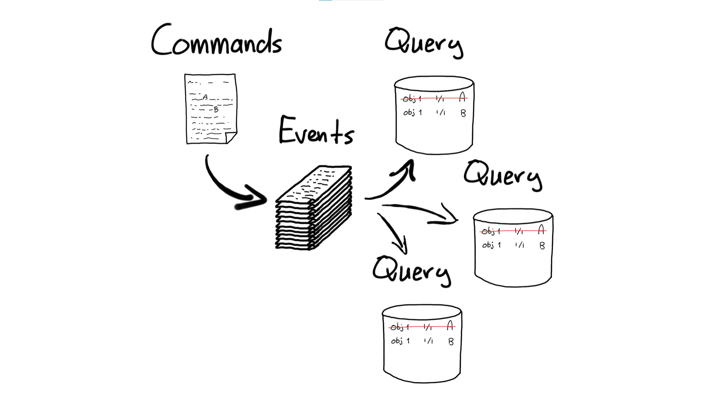

Een belangrijk onderdeel van het protocol-denken en ook een relevant onderwerp van vandaag, is de
herkomst en het ontstaan van data. In de geschiedenis van registers, grootboeken op papier, de
standaardisatie daarvan, de mechanisatie daarvan en vervolgens de automatisering daarvan, staan we
op het punt om onze processen opnieuw te gaan ontwerpen voor een echte _digitalisering_ (zie [papier
naar digitaal](./papier-naar-digitaal.md)). Hier moeten we bekennen dat we van mechanisatie naar
automatisering vooral de papieren boeken hebben gerespecteerd en digitaal beschikbaar gemaakt. Onze
boeken, registers, grootboeken hebben we in een database en bijbehorende applicatie gestopt. Da's
een mooi begin ... maar we hebben een volgende stap nodig om het ontstaan van data serieus te
beschrijven en digitaal beschikbaar te maken. Dit is een paradigma verschuiving, een 'paradigm
shift'.

Voor het ontstaan is het architectuurpatroon [Event Sourcing](./achtergrond/event-sourcing.md) van
groot belang. Het is niet de 'heilige graal' en de oplossing voor alles, maar het geeft antwoord op
het ontstaan van data, op de evolutie van data. Het adresseert ook dat data-gebeurtenissen, oftewel
events, gebeurd zijn en dat we daar 'mee moeten dealen'. Als er een fout in een register zit, kunnen
we dat register vrij eenvoudig aanpassen, ook in het verleden. Met events dienen we dat expliciet te
beschrijven en daarmee moeten we _ontwerpen_ hoe en dat we correcties gaan toepassen.

Een ander aspect van [Event Sourcing](./achtergrond/event-sourcing.md) is dat de evolutie van een
register, een grootboek, beschreven in de stroom van events (data-gebeurtenissen), leidt tot een
_projectie_. Ons bekende register, grootboek, boek met resultaten is _dé_ projectie van de events,
welke wordt opgebouwd door alle events 'af te spelen' volgens regels. Het is onze _énige_ projectie,
maar ... Met Event Souring wordt het mogelijk om _meerdere_ projecties te maken op basis van
dezelfde stroom van events. Er is hierin zeer zeker een _primaire projectie_ wat de reden van het
register of grootboek is. Tegelijk zijn er eerdere meerdere en vele projecties die secundair zijn
aan de primaire reden van bestaan en zeer relevant zijn. Zeker in het geval dat de data, het
register, het grootboek, ergens anders gebruikt wordt. Het is zeer waarschijnlijk dat dit gebruik
van de data een aangepaste projectie nodig heeft die specifiek past bij die behorende
[context](./context.md) waarin de data gebruikt wordt.

> Er kan veel kennis en ervaring gehaald worden uit het architectuurpatroon [Event
> Sourcing](./achtergrond/event-sourcing.md). (Nogmaals) dit is geen 'silver bullet' en altijd en
> overal toe te passen. En tegelijk biedt het wel veel aanknopingspunten voor de digitale
> samenleving waar we naartoe werken.
