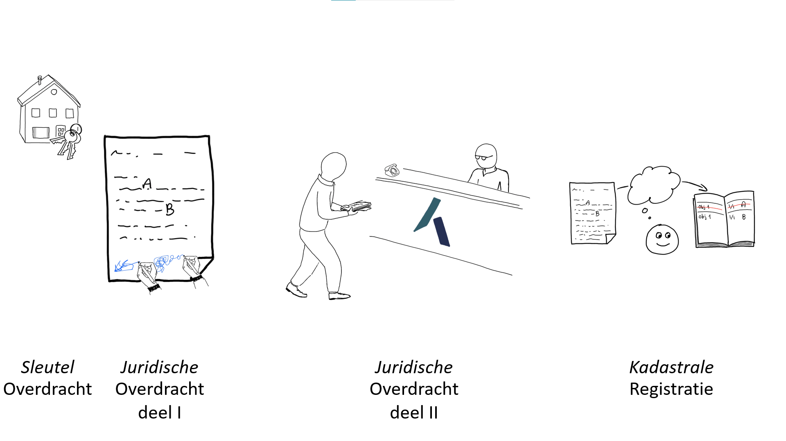

Om te kunnen zien en bedenken welke richting de ontwikkelingen opgaan, is het van belang om naar de
geschiedenis te kijken. In het digitale tijdperk en zeker vandaag de dag, anno 2024, is _data_ een
veelbesproken onderwerp. Maar waar komt de data van vandaag eigenlijk vandaan? Hoe is die data
ontstaan?

> History doesn't repeat itself, but it often rhymes -
> ([arguably](https://quoteinvestigator.com/2014/01/12/history-rhymes/)) Mark Twain

## Kort overzicht

- [1960 Mechanisatie](#1960-mechanisatie) Van handgeschreven naar typemachines,
  gestandaardiseerde formulieren
- [1980 Automatisering databases](#1980-automatisering-databases) Boeken van registers in
 databases  Applicatie en database zijn vervlochten
- [2000 Automatisering Applicaties](#2000-automatisering-applicaties) Applicatie bevat logica en
  zorgt voor data integriteit Applicatie en database staan los van elkaar
- [2020 Automatisering API's](#2020-automatisering-apis) Data kan los bevraagd worden door andere
  applicaties API First
- [2040 Digitalisering](#2040-digitalisering) Toevoeging van semantiek, events (gebeurtenissen),
  geautomatiseerde procesuitvoering en open samenwerking Ketens van software + uitvoerbare
  contracten + projecties

## 1960 Mechanisatie

> Van handgeschreven naar typemachines, gestandaardiseerde formulieren

Zo rond de jaren '60 van de vorige eeuw kwam de mechanisatie goed op gang. Waar voorheen
handgeschreven papieren de standaard waren, kwamen er standaard formulieren en typemachines om
schaalbaarder en herkenbaarder te gaan werken. Deze getypte formulieren waren echte papieren
documenten en werken voorzien van 'natte handtekeningen'; door mensen met inkt ondertekende
handtekeningen.

Bij het kopen van een huis werden de aktes door de notaris opgesteld en uitgetypt. Nou ja, dat
uittypen werd meestal door (vrouwelijke!) medewerkers gedaan. Nadat de benodigde handtekeningen
gezet waren, bracht de notaris de aktes van die dag naar het kantoor van het Kadaster. Daar werden
de aktes ingeschreven in het Openbaar Register en vervolgens door Kadaster clerken verwerkt in de
Kadastrale Registratie. Dit was een boek (eigenlijk een serie boeken) waarin de huidige eigenaren
werden bijgehouden. Als een akte werd verwerkt, werd de verkopende partij als eigenaar _doorgehaald_
en de koper als nieuwe eigenaar toegevoegd, uiteraard voorzien van de juiste aandelen van dat
eigendom en referentie naar het stuk, de akte. Deze boeken werden _leggers_ genoemd. Een grootboek
van de eigendommen van de percelen in Nederland.

## 1980 Automatisering Databases

> Boeken van registers in databases  Applicatie en database zijn vervlochten

Zo naar de jaren '80 was automatisering een gemeen goed. Computersystemen als mainframes en ook de
_Personal Computer_, de PC, werden toegankelijk en bruikbaar. De aandacht voor de automatisering
waren voor de interne processen en vooral _indexen_. Het kunnen zoeken door informatie om sneller en
gemakkelijker informatie te kunnen geven - via de telefoon en fax - waren de voornaamste drijfveren.
In deze automatiseringsslag zijn vooral de leggers, **de grootboeken in databases gestopt**!

In de jaren daarna kwam ook de uitwisseling van documenten op gang. Zo in de jaren '90 kwamen er
oplossingen om documenten in een digitaal formaat te kunnen versturen. Eerst via email en later via
internet. De nadruk en aandacht van deze automatisering was **het transport van documenten tussen
organisaties**.

De technologische staat van die tijd is een rijke en grote database met veel functionaliteiten en
een kleine applicatie laag daar omheen voor de gebruikersinteractie.

## 2000 Automatisering Applicaties

> Applicatie bevat logica en zorgt voor data integriteit Applicatie en database staan los van
  elkaar

In de jaren 2000 werd software ontwikkeling een belangrijker onderdeel. Een database was 'maar' een
deel van de gebruikerservaring en mogelijkheden. Een applicatie was veel rijker in logica en
'ergens' werd uiteraard de data uit de database wel gebruikt en gewijzigd. Waar voorheen alle
wijzigingen door de database beheerd werden, werd nu de applicatie steeds meer verantwoordelijk voor
de logica en integriteit van de data. De database was 'slechts' de opslag van data, de integriteit
'in rust' en het kunnen doorzoeken van de data.

Dit zorgde ervoor dat de applicatie en de database los van elkaar kwamen te staan. De database had
duidelijke taken en technische performance-eisen. De applicatie had andere verantwoordelijkheden en
ook andere schalingsvereisten. In deze scheiding werd het duidelijker wat 'de data' was en wat 'de
logica' was. En wat hun verhouding was.

## 2020 Automatisering API's

> Data kan los bevraagd worden door andere applicaties API First

Met de groei van het internet en daarmee het integreren van ketens, werden de koppelvlakken tussen
delen in de keten steeds relevanter. En waar in de voorgaande jaren de applicatie 'de baas' was,
werd data steeds vaker direct uit de database gehaald en gebruikt. Het wijzigen van data gebeurt nog
steeds door een applicatie met strikte logica, maar het gebruik van de data is ook mogelijk _zonder_
de applicatie.

Het wordt steeds belangrijker dat de data goed toegankelijk is. In het tijdperk van internet zijn
het de internetprotocollen die daarvoor moeten zorgen. Data via HTTP kunnen ophalen, bevragen en in
samenhang kunnen brengen met andere data. Dit vraagt om _Application Programming Interfaces_,
oftewel **API's**. Met het gebruik en de opkomst van API's komt de data nog verder los van de
muterende applicaties en wordt het steeds meer van belang om te weten wat die data betekent en in
welke context deze ontstaan is. De roep om semantiek en de opkomst van technologieën (zoals Linked
Data) die daar invulling aan geven, is duidelijk zichtbaar.

## 2040 Digitalisering

> Toevoeging van semantiek, events (gebeurtenissen), geautomatiseerde procesuitvoering en open
  samenwerking Ketens van software + uitvoerbare contracten + projecties

In 2020 is de basis van de automatisering nog steeds de papieren processen die geautomatiseerd zijn.
Er komen echter technologieën die _digitaal ondertekenen_ mogelijk maken en _smart contracts_.
Hiervoor is het noodzakelijk dat processen echt _digitaal_ ontworpen zijn en is het nog meer van
belang dat data goed voorzien is van metadata.

Het is vandaag nog niet mogelijk om precies te weten hoe die digitalisering eruit ziet in 2040. We
kunnen niet in de toekomst kijken. Maar we kunnen wél kijken wat er 'rijmt op het verleden'!

De metadata van de data beschrijft niet alleen wat de data betekent. Het moet ook antwoord kunnen
geven op waar de data vandaan komt. Waar is deze ontstaan? Onder welke voorwaarden / situatie? En
met het aantal devices dat - via het internet - verbonden is aan elkaar, worden _decentrale
netwerken_ steeds meer van belang. Op welke manier is het mogelijk om autonoom te handelen en
transacties uit te voeren die toch in het grote geheel integer zijn en blijven en impact daarin
hebben?

## Transitie naar digitalisering

Onze gooi naar de toekomst is een aantal concepten die we gezamenlijk **denken in protocollen** noemen.
Waarom? Omdat digitale processen een door computers (machines) uitvoerbare contracten gaan uitvoeren
waarin data-uitwisseling is meegenomen en de interactie met gebruikers, de mens, duidelijk en
effectief is. Dat betekent dat de internetprotocollen die 'slechts' de verbinding tussen apparaten
realiseert, uitgebreid moeten worden met smart contracts of iets wat daarop lijkt. Is het
blockchain? Nee. Ja. Mischien. Blockchain regelt digitale processen wel op een nieuwe manier. Daar
moeten we zeker lering van trekken. In ieder geval wel iets met transacties ... of gebeurtenissen,
events. Maar er is meer. Het is ook Linked Data. Het is ook Open Standaarden, Open Source, open
samenwerken. Het gaat namelijk over de uitwisseling in ketens. Dat betreft altijd meerdere partijen
die gezamenlijk moeten werken en zorgdragen voor de smart contracts. Het betekent
[automatisering](./automatisering.md) nog veel verder doorvoeren.

Lees verder ... :smiley:
