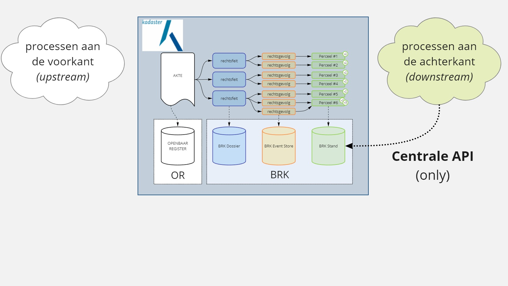
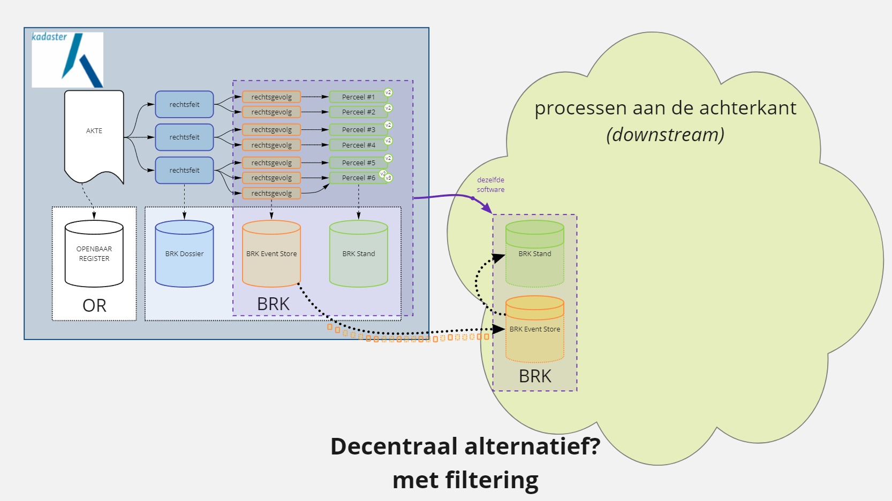

In het bijhouden van de <a href="" target="_blank">Basisregistratie Kadaster (BRK)</a> maakt het
Kadaster gebruik van [Event Sourcing](../../achtergrond/event-sourcing.md). Daarvoor heeft het
Kadaster de paradigma verschuiving doorgemaakt van 'single model' naar 'Commands, Events & Queries'.

## KOERS

Het oorspronkelijke systeem kende een gescheiden systeem voor de notariële aktes in het Openbaar
Register en de BRK (AKR, Automatisering Kadastrale Registratie). Herkenbaar. Gebruikelijk.

Voor het nieuwe systeem, KOERS, het Kadastraal Objecten en Rechten Systeem, hebben we moeten
ontwerpen welke gegevens (data) in de notariële aktes staan. Deze noemen we 'Rechtsfeiten'.
Vervolgens hebben ontworpen, de Kadasterwet in de hand, hoe Rechtsfeiten wijzigingen in de
Kadastrale Registratie effectueren. Dat  hebben we beschreven in 'Rechtsgevolgen'. Dit zijn de
Events uit [Event Sourcing](../achtergrond/event-sourcing.md). En vervolgens hebben we ook de
verwerking in de (primaire) projectie ontworpen.

Uiteraard hebben we de ontwerpen omgezet in werkende software. Het KOERS systeem (dubbelop voor de
oplettende lezer :wink: ) Side note: We hebben daarbij [automatisering](../automatisering.md)
serieus genomen door de toepassing van _continuous delivery_. Gestart tijdens de projectfase,
doorgezet sinds de livegang oktober '18, tot vandaag de dag nog steeds met continue releases naar de
productie omgeving :muscle:

## Kansen

Het systeem [KOERS](#koers) biedt veel kansen om door te ontwikkelen richting een
[gebeurtenisgedreven register](../oplossingen.md#gebeurtenisgedreven-registers). En toch. In de
digitale overheid van vandaag wordt vooral gestuurd op 'een centrale API'. Eén bron. Eén _centrale_
API. Uitsluitend gebruik van deze centrale API door alles en iedereen.

Vanuit het **denken in protocollen** is dit ... een goede ontwikkeling om allerlei ongecontroleerde
kopieën van de BRK tegen te gaan. _MAAR_ het is ook _ontoereikend_ en zelfs _onmogelijk_ als
eindoplossing. En wat is dan een alternatief scenario? Wel ... (nogmaals) denken in protocollen
:grin: Om te beginnen is een _door de bronhouder, dus Kadaster, gecontroleerde kopie bij een andere
partij_ wél mogelijk (opnieuw, op basis van [gebeurtenisgedreven
registers](../oplossingen.md#gebeurtenisgedreven-registers)).

Hier komen _nieuwe mogelijkheden_ tot onze beschikking! Het is mogelijk om per afnemer te _filteren_ :muscle:

En in de toekomst wordt ..

// TODO

