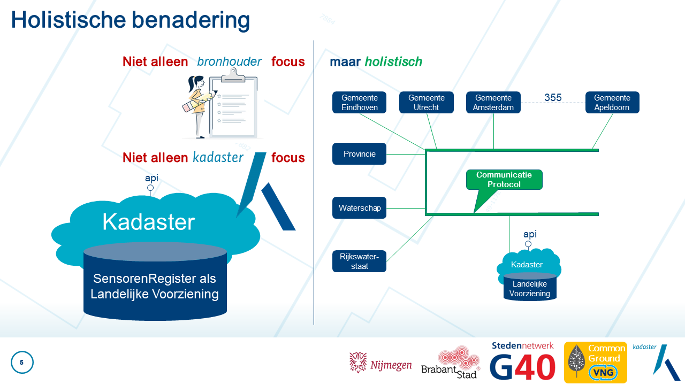
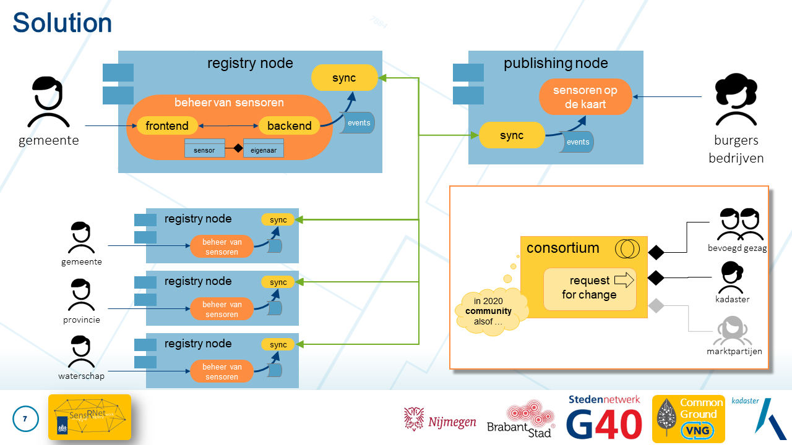

<a href="https://kadaster-labs.github.io/sensrnet-home/" target="_blank">SensRNet</a>, uitgesproken
als 'sensornet', is de samenvoeging van **Sensor Registry Network**. Het Kadaster is betrokken
geweest bij de opzet daarvan. Het idee daarbij is een andere benadering dan de huidige inrichtingen
en oplossingen van software paketten bij bronhouders, een Landelijke Voorziening bij het Kadaster en
onderhandelingen over de API daartussen.

SensRNet is een holistische benadering van het probleem. Er zijn bronhouders die een behoefte hebben
en daar software voor nodig hebben. We willen graag een gestandaardiseerde ontsluiting van _alle_
sensoren in Nederland. Dat wil zeggen: de _metadata_ over sensoren. Welke sensor bevindt zich op
welke plaats, wat meet die dan en wie zit daar achter? En in plaats van allemaal losse onderdelen
los van elkaar te ontwerpen, willen we het hele probleem beschouwen en met een passende oplossing
komen.

De oplossing (solution) is een modulair systeem, opgezet als open source project (zie [open
samenwerken](../oplossingen.md#open-samenwerken)). In dit project dienen de verschillende onderdelen
'opgelost' te worden. Dat betekent software voor de bronhouder om zelfstandig sensoren (metadata) te
kunnen beheren, maar ook software om alle (metadata over) sensoren te kunnen ontsluiten én de
data-uitwisseling daartussen! Hierbij is gebruik gemaakt van het concept van [gebeurtenisgedreven
registers](../oplossingen.md#gebeurtenisgedreven-registers). Bronhouders beheren de metadata over
hun eigen sensoren en de _wijzigingen_ die daarbij te weeg worden gebracht, worden gedeeld binnen
het netwerk. Dit wordt een _Registry Node_ genoemd. Vervolgens worden deze wijzigingen intern
verwerkt zodat de gebruiker bijgewerkte metadata op een kaart geprojecteerd ziet én deze wijzigingen
worden in het netwerk gedeeld met alle andere nodes. De _Publishing Node_ is dan niets meer dan een
eenvoudige instantie waarin óók de stand wordt opgebouwd op basis van dezelfde events / wijzigingen.

